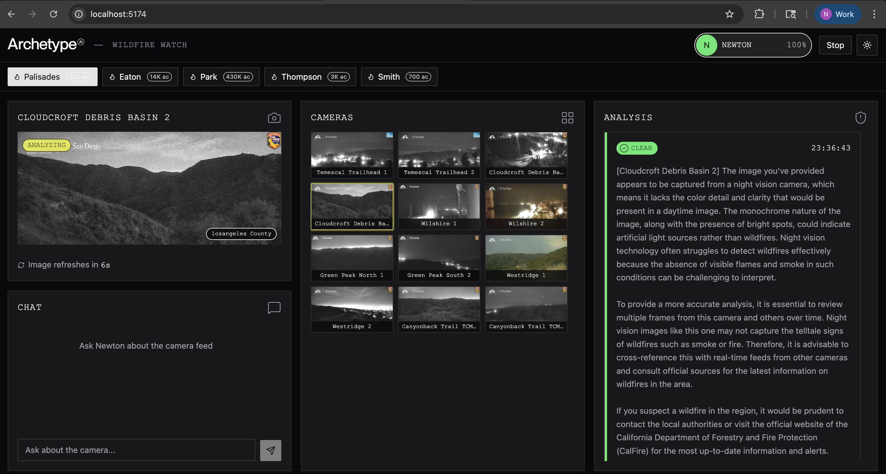

# Newton Wildfire Watch

Real-time wildfire detection dashboard powered by [Newton](https://www.archetypeai.io/) and the [ALERTCalifornia](https://alertcalifornia.org/) camera network.

Monitors 1,200+ wildfire cameras across California, focused on 5 major fire zones from recent devastating wildfires. Newton analyzes live camera frames for smoke, fire, haze, and visibility changes.



## Fire Zones

| Zone | Fire | Year | Acres | County |
|------|------|------|-------|--------|
| Palisades | Palisades Fire | Jan 2025 | 23,448 | Los Angeles |
| Eaton | Eaton Fire | Jan 2025 | 14,021 | Los Angeles |
| Park | Park Fire | Jul 2024 | 429,603 | Butte / Tehama |
| Thompson | Thompson Fire | Jul 2024 | 3,000+ | Butte |
| Smith | Smith Fire | Feb 2025 | 700+ | San Diego |

## Features

- **Multi-camera grid** — browse up to 12 cameras per fire zone with auto-refreshing thumbnails (15s) and a live per-camera risk dot
- **Continuous zone scan** — one toggle scans every camera in the zone on a loop (~30s cycle), keeping the risk dots fresh; a countdown shows when the next scan runs
- **Per-camera detail** — click any camera to open a modal with its live frame and Newton's detailed analysis
- **Risk classification** — Clear / Watch / Danger labels based on Newton's assessment
- **Zone analysis history** — a running log of zone-level overviews over time
- **Zone chat** — ask Newton about the whole zone or a specific camera, grounded in the latest scan
- **Zone switching** — switch between 5 fire zones to monitor different regions

## Stack

- **SvelteKit** with Svelte 5 runes
- **Archetype AI Design System** — semantic tokens, component primitives, composite patterns
- **Newton API** — C 2.6 fusion model (`Newton::c2_6_8b_fp8_*`) via the stateless Direct Query API (`/v0.5/query`); no lens/session
- **ALERTCalifornia** — public camera data (JPEG snapshots, no auth required)
- **Tailwind v4** — styling with semantic design tokens

## Setup

```bash
npm install
```

Create a `.env` file:

```
ATAI_API_KEY=your_api_key_here
ATAI_API_ENDPOINT=https://api.u1.archetypeai.app/
```

## Development

```bash
npm run dev
```

Open `http://localhost:5173`, select a fire zone, then click **Scan Zone**.

## How It Works

All Newton calls use the stateless **Direct Query API** (`/v0.5/query`) — there is no lens or session lifecycle.

1. Select a fire zone — up to 12 nearby cameras load from the ALERTCalifornia API
2. **Scan Zone** starts a continuous loop. Each pass analyzes every camera in the zone in small **multi-image batches** (4 frames per `/query`, run sequentially to stay within the model's GPU limits); each batch returns a per-camera risk status
3. A final **text-only** `/query` synthesizes a single zone overview from the per-camera findings. Statuses drive the grid risk dots; the overview is appended to the Zone Analysis history
4. Click any camera to open a modal with its full frame and a fresh **detailed** analysis (a single-image `/query`)
5. The chat answers questions about the zone or a specific camera by name, grounded in the latest scan findings (text-only `/query`)
